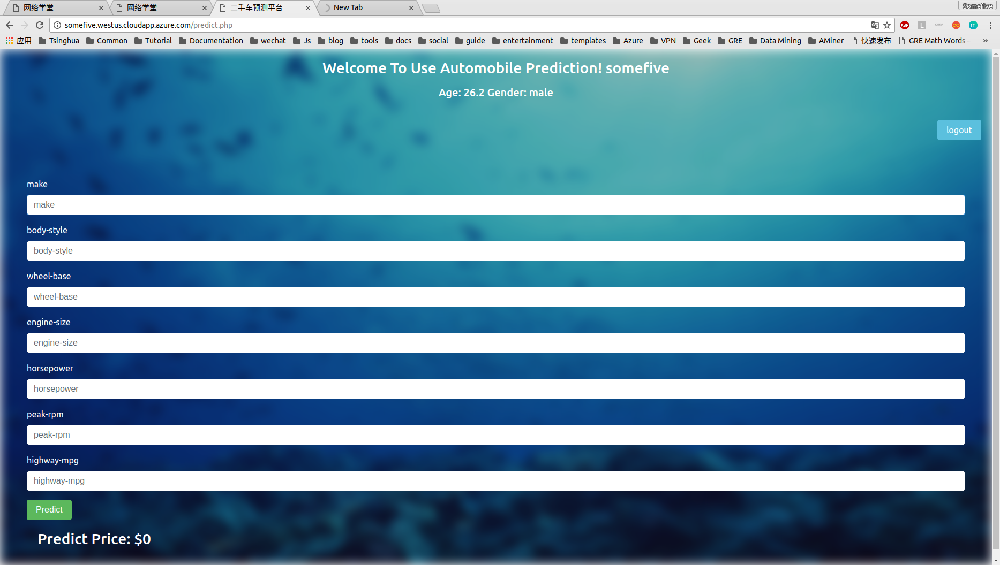

# MSAI System

#### This is a Price Evaluation of second-hand automobiles based on Microsoft AI services.

### Functions

1. Register/Login with face capture. When registered, the corresponding api is called and identify the gender and age of the person.
2. With some input data, the price of second-hand automobile is calculated based on machine learning methods.

### Captures

### URL

somefive.westus.cloudapp.azure.com

### Develop Environment

Ubuntu 16.10 on Azure

### Develop Language

PHP 7 + Curl + Redis + HTML/CSS/Javascript (with Jquery, Webcam, Bootstrap)

